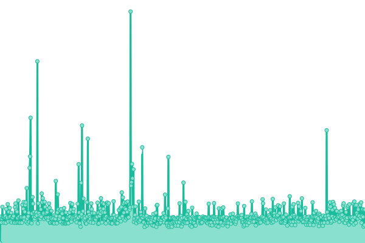
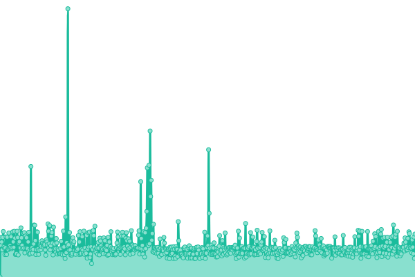
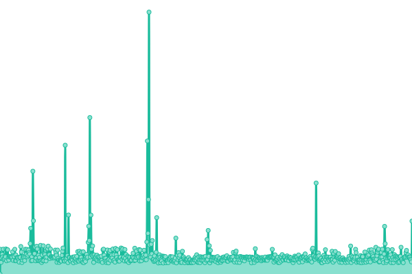
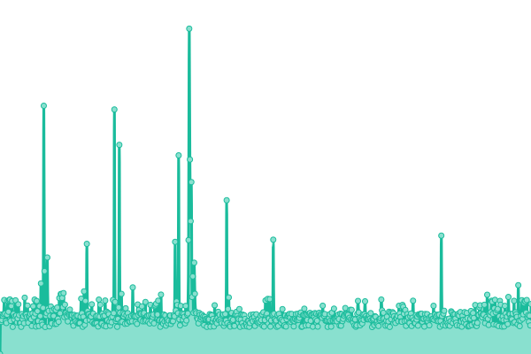

# [📈 Live Status](https://demo.upptime.js.org): <!--live status--> **🟩 All systems operational**

This repository contains the open-source uptime monitor and status page for [Hien Nguyen](https://demo.upptime.js.org), powered by [Upptime](https://github.com/upptime/upptime).

With [Upptime](https://upptime.js.org), you can get your own unlimited and free uptime monitor and status page, powered entirely by a GitHub repository. We use [Issues](https://github.com/nthien/monitor_dcorp/issues) as incident reports, [Actions](https://github.com/nthien/monitor_dcorp/actions) as uptime monitors, and [Pages](https://demo.upptime.js.org) for the status page.

<!--start: status pages-->
<!-- This summary is generated by Upptime (https://github.com/upptime/upptime) -->
<!-- Do not edit this manually, your changes will be overwritten -->
<!-- prettier-ignore -->
| URL | Status | History | Response Time | Uptime |
| --- | ------ | ------- | ------------- | ------ |
|  [uat-id](https://uat-id.dcorp.com.vn) | 🟩 Up | [uat-id.yml](https://github.com/nthien/monitor_dcorp/commits/HEAD/history/uat-id.yml) | 

 1471ms
     
 | 

<a href="https://nthien.github.io/monitor_dcorp/history/uat-id">100.00%</a>
    

|  [uat-skyinvoice](https://uat-skyinvoice.dcorp.com.vn) | 🟩 Up | [uat-skyinvoice.yml](https://github.com/nthien/monitor_dcorp/commits/HEAD/history/uat-skyinvoice.yml) | 

 1429ms
     
 | 

<a href="https://nthien.github.io/monitor_dcorp/history/uat-skyinvoice">100.00%</a>
    

|  [uat-skyorder](https://uat-skyorder.dcorp.com.vn) | 🟩 Up | [uat-skyorder.yml](https://github.com/nthien/monitor_dcorp/commits/HEAD/history/uat-skyorder.yml) | 

 1719ms
     
 | 

<a href="https://nthien.github.io/monitor_dcorp/history/uat-skyorder">100.00%</a>
    

|  [uat-skyrequest](https://uat-skyrequest.dcorp.com.vn) | 🟩 Up | [uat-skyrequest.yml](https://github.com/nthien/monitor_dcorp/commits/HEAD/history/uat-skyrequest.yml) | 

 2060ms
     
 | 

<a href="https://nthien.github.io/monitor_dcorp/history/uat-skyrequest">100.00%</a>
    

<!--end: status pages-->

[**Visit our status website →**](https://demo.upptime.js.org)

## 📄 License

- Powered by: [Upptime](https://github.com/upptime/upptime)
- Code: [MIT](./LICENSE) © [Anand Chowdhary](https://anandchowdhary.com), supported by [Pabio](https://pabio.com)
- Data in the `./history` directory: [Open Database License](https://opendatacommons.org/licenses/odbl/1-0/)
